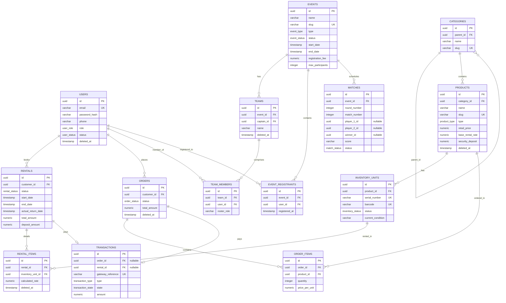

# SportNest - Relational Database Schema & Architecture Design

**Document Reference:** SN-DB-V1.0  
**Version:** 1.0.0-Release  
**Author:** Lead Software Architect  
**Target Engine:** PostgreSQL 16+ (PostgreSQL dialect compatibility)  

---

## 1. Architectural Standards

To ensure referential integrity, performance, and scalability across the transactional systems of SportNest, all physical database schemas must conform to the following architectural design patterns.

### 1.1 Table & Column Naming Conventions
*   **Case Sensitivity:** All identifiers (table names, column names, constraints, and indexes) must be lowercase using snake_case (e.g., `inventory_units`, `stripe_charge_id`).
*   **Pluralisation:** Table names must be pluralised (e.g., `users`, `products`, `orders`). Join tables representing N:M relationships must use alphabetical order of their referenced tables, joined by a single underscore (e.g., `events_users`).
*   **Id Columns:** Every table must utilize a surrogate primary key column named `id` defined as a Universally Unique Identifier (UUIDv7) to prevent enumeration attacks and support distributed/monorepo scaling.

### 1.2 Auditing Design Pattern
Every table in the database must include a uniform block of audit metadata columns to ensure lineage:
*   `created_at`: `TIMESTAMP WITH TIME ZONE` defaulting to `CURRENT_TIMESTAMP`. Immutable.
*   `updated_at`: `TIMESTAMP WITH TIME ZONE` defaulting to `CURRENT_TIMESTAMP`. Mutated via an automated database trigger on row updates.
*   `created_by`: `UUID` (Foreign key to `users.id`, nullable for guests/anonymous checkouts).
*   `updated_by`: `UUID` (Foreign key to `users.id`, nullable).

```sql
-- Standard PostgreSQL Trigger Pattern for auditing:
CREATE OR REPLACE FUNCTION update_updated_at_column()
RETURNS TRIGGER AS $$
BEGIN
   NEW.updated_at = CURRENT_TIMESTAMP;
   RETURN NEW;
END;
$$ language 'plpgsql';
```

### 1.3 Soft Delete Design Pattern
Physical `DELETE` statements are prohibited on core business entities to preserve historical transactions, reporting integrity, and ledger audits.
*   **Logical Column:** Tables in scope must contain a `deleted_at` column of type `TIMESTAMP WITH TIME ZONE`, default `NULL`.
*   **Delete Execution:** A deletion operation must perform a logical update: `UPDATE table SET deleted_at = CURRENT_TIMESTAMP WHERE id = :id`.
*   **Query Filtering:** All application read queries must include a filter clause `WHERE deleted_at IS NULL` unless explicitly requesting archived/deleted records.
*   **Unique Index Integrity:** Standard SQL unique indexes collide on soft-deleted rows. To allow recycling of unique fields (like email or slugs), all unique constraints on soft-deletable tables must be partial indexes:
    ```sql
    CREATE UNIQUE INDEX idx_users_email_active ON users(email) WHERE deleted_at IS NULL;
    ```

---

## 2. Global Database Enums

```
                               ┌────────────────────────────────────────────────────────┐
                               │                      Global Enums                      │
                               ├───────────────────┬────────────────────────────────────┤
                               │ Enum Name         │ Defined Value Literals             │
                               ├───────────────────┼────────────────────────────────────┤
                               │ user_role         │ guest, customer, staff, admin,     │
                               │                   │ super_admin                        │
                               ├───────────────────┼────────────────────────────────────┤
                               │ user_status       │ active, inactive, suspended        │
                               ├───────────────────┼────────────────────────────────────┤
                               │ product_type      │ retail, rental, hybrid             │
                               ├───────────────────┼────────────────────────────────────┤
                               │ inventory_status  │ available, reserved, rented,       │
                               │                   │ maintenance, damaged               │
                               ├───────────────────┼────────────────────────────────────┤
                               │ rental_status     │ booked, active, returned, overdue, │
                               │                   │ cancelled                          │
                               ├───────────────────┼────────────────────────────────────┤
                               │ order_status      │ pending, paid, ready_for_pickup,   │
                               │                   │ completed, cancelled               │
                               ├───────────────────┼────────────────────────────────────┤
                               │ transaction_type  │ hold, capture, charge, refund      │
                               ├───────────────────┼────────────────────────────────────┤
                               │ transaction_state │ pending, success, failed           │
                               ├───────────────────┼────────────────────────────────────┤
                               │ event_type        │ individual, team                   │
                               ├───────────────────┼────────────────────────────────────┤
                               │ event_status      │ registration_open,                 │
                               │                   │ registration_closed, live,         │
                               │                   │ completed, cancelled               │
                               ├───────────────────┼────────────────────────────────────┤
                               │ bracket_format    │ single_elimination,                │
                               │                   │ double_elimination                 │
                               ├───────────────────┼────────────────────────────────────┤
                               │ match_status      │ scheduled, live, completed,        │
                               │                   │ walkover                           │
                               └───────────────────┴────────────────────────────────────┘
```

---

## 3. Entity-Relationship (ER) Diagram



---

## 4. Database Table Definitions

### 4.1 Users Table (`users`)
Holds core account records for Customers, Staff, and Administrators.

*   **Enums Applied:** `user_role`, `user_status`
*   **Audit Blocks:** Present
*   **Soft Delete:** Present

| Column Name | Data Type | Nullable | Keys | Constraints | Default | Description |
| :--- | :--- | :---: | :---: | :--- | :--- | :--- |
| `id` | `UUID` | No | PK | - | `gen_random_uuid()` | Primary Identifier (v7 format) |
| `email` | `VARCHAR(255)` | No | - | Check syntax pattern | - | User login email address |
| `password_hash` | `VARCHAR(255)` | No | - | - | - | Salted bcrypt hash |
| `phone` | `VARCHAR(20)` | Yes | - | Numeric only | - | Mobile contact string |
| `first_name` | `VARCHAR(100)` | No | - | - | - | First name |
| `last_name` | `VARCHAR(100)` | No | - | - | - | Last name |
| `role` | `user_role` | No | - | - | `'customer'` | Security access clearance level |
| `status` | `user_status` | No | - | - | `'active'` | Operating account status |
| `deleted_at` | `TIMESTAMP WITH TZ` | Yes | - | - | `NULL` | Soft delete execution timestamp |

### 4.2 Categories Table (`categories`)
Hierarchical navigation mapping for retail and rental stock categories.

*   **Enums Applied:** None
*   **Audit Blocks:** Present
*   **Soft Delete:** Present

| Column Name | Data Type | Nullable | Keys | Constraints | Default | Description |
| :--- | :--- | :---: | :---: | :--- | :--- | :--- |
| `id` | `UUID` | No | PK | - | `gen_random_uuid()` | Primary Identifier |
| `parent_id` | `UUID` | Yes | FK | References `categories.id` | `NULL` | Parent nested node key |
| `name` | `VARCHAR(100)` | No | - | - | - | Public listing name |
| `slug` | `VARCHAR(120)` | No | - | Alpha-numeric-dash | - | URL router string |
| `deleted_at` | `TIMESTAMP WITH TZ` | Yes | - | - | `NULL` | Soft delete execution timestamp |

### 4.3 Products Table (`products`)
Unified product definitions catalogued in SportNest. Defines price baselines.

*   **Enums Applied:** `product_type`
*   **Audit Blocks:** Present
*   **Soft Delete:** Present

| Column Name | Data Type | Nullable | Keys | Constraints | Default | Description |
| :--- | :--- | :---: | :---: | :--- | :--- | :--- |
| `id` | `UUID` | No | PK | - | `gen_random_uuid()` | Primary Identifier |
| `category_id` | `UUID` | No | FK | References `categories.id` | - | Primary mapping department |
| `name` | `VARCHAR(255)` | No | - | - | - | Commercial catalog name |
| `slug` | `VARCHAR(270)` | No | - | Alpha-numeric-dash | - | URL lookup selector |
| `description` | `TEXT` | Yes | - | - | - | Rich description content |
| `type` | `product_type` | No | - | - | - | Sales model identifier |
| `retail_price` | `NUMERIC(12, 2)` | Yes | - | $\ge 0.00$ | `NULL` | Outright purchase price |
| `base_rental_rate`| `NUMERIC(12, 2)` | Yes | - | $\ge 0.00$ | `NULL` | Per-day starting rental fee |
| `security_deposit`| `NUMERIC(12, 2)` | Yes | - | $\ge 0.00$ | `NULL` | Credit card verification hold |
| `deleted_at` | `TIMESTAMP WITH TZ` | Yes | - | - | `NULL` | Soft delete execution timestamp |

### 4.4 Inventory Units Table (`inventory_units`)
Unique database record for every individual piece of hardware. Maps to a serial code.

*   **Enums Applied:** `inventory_status`
*   **Audit Blocks:** Present
*   **Soft Delete:** No

| Column Name | Data Type | Nullable | Keys | Constraints | Default | Description |
| :--- | :--- | :---: | :---: | :--- | :--- | :--- |
| `id` | `UUID` | No | PK | - | `gen_random_uuid()` | Primary Identifier |
| `product_id` | `UUID` | No | FK | References `products.id` | - | Generic definition model link |
| `serial_number`| `VARCHAR(100)` | No | - | - | - | Manufacturer physical serial code |
| `barcode` | `VARCHAR(100)` | No | - | - | - | Internal scan tag identifier |
| `status` | `inventory_status` | No | - | - | `'available'` | Tracking state variable |
| `current_condition`| `TEXT` | No | - | - | `'excellent'` | Quality check audit description |

### 4.5 Rentals Table (`rentals`)
Parent aggregate record for a rental booking placed by a client.

*   **Enums Applied:** `rental_status`
*   **Audit Blocks:** Present
*   **Soft Delete:** Present

| Column Name | Data Type | Nullable | Keys | Constraints | Default | Description |
| :--- | :--- | :---: | :---: | :--- | :--- | :--- |
| `id` | `UUID` | No | PK | - | `gen_random_uuid()` | Primary Identifier |
| `customer_id` | `UUID` | No | FK | References `users.id` | - | Client booking identifier |
| `status` | `rental_status` | No | - | - | `'booked'` | State tracker |
| `start_date` | `TIMESTAMP WITH TZ` | No | - | - | - | Intended pick up timestamp |
| `end_date` | `TIMESTAMP WITH TZ` | No | - | $\gt$ `start_date` | - | Contract return deadline |
| `actual_return_date`| `TIMESTAMP WITH TZ`| Yes | - | - | `NULL` | Time returned to staff custody |
| `total_amount` | `NUMERIC(12, 2)` | No | - | $\ge 0.00$ | - | Sum of calculated day rates |
| `deposit_amount`| `NUMERIC(12, 2)` | No | - | $\ge 0.00$ | - | Sum of item deposits |
| `deleted_at` | `TIMESTAMP WITH TZ` | Yes | - | - | `NULL` | Soft delete execution timestamp |

### 4.6 Rental Items Table (`rental_items`)
Line items referencing specific inventory serial units reserved in a rental.

*   **Enums Applied:** None
*   **Audit Blocks:** Present (Simplified)
*   **Soft Delete:** Yes

| Column Name | Data Type | Nullable | Keys | Constraints | Default | Description |
| :--- | :--- | :---: | :---: | :--- | :--- | :--- |
| `id` | `UUID` | No | PK | - | `gen_random_uuid()` | Primary Identifier |
| `rental_id` | `UUID` | No | FK | References `rentals.id` | - | Parent rental reference |
| `inventory_unit_id`| `UUID` | No | FK | References `inventory_units.id` | - | Specific serial unit assigned |
| `calculated_rate`| `NUMERIC(12, 2)` | No | - | $\ge 0.00$ | - | Actual rate billed (day unit) |
| `deleted_at` | `TIMESTAMP WITH TZ` | Yes | - | - | `NULL` | Soft delete execution timestamp |

### 4.7 Orders Table (`orders`)
E-commerce retail orders containing sales checkout structures.

*   **Enums Applied:** `order_status`
*   **Audit Blocks:** Present
*   **Soft Delete:** Present

| Column Name | Data Type | Nullable | Keys | Constraints | Default | Description |
| :--- | :--- | :---: | :---: | :--- | :--- | :--- |
| `id` | `UUID` | No | PK | - | `gen_random_uuid()` | Primary Identifier |
| `customer_id` | `UUID` | No | FK | References `users.id` | - | Buyer identification link |
| `status` | `order_status` | No | - | - | `'pending'` | Processing checkpoint |
| `total_amount` | `NUMERIC(12, 2)` | No | - | $\ge 0.00$ | - | Invoice final amount |
| `deleted_at` | `TIMESTAMP WITH TZ` | Yes | - | - | `NULL` | Soft delete execution timestamp |

### 4.8 Order Items Table (`order_items`)
Checkout details representing quantities purchased of standard products.

*   **Enums Applied:** None
*   **Audit Blocks:** None
*   **Soft Delete:** No

| Column Name | Data Type | Nullable | Keys | Constraints | Default | Description |
| :--- | :--- | :---: | :---: | :--- | :--- | :--- |
| `id` | `UUID` | No | PK | - | `gen_random_uuid()` | Primary Identifier |
| `order_id` | `UUID` | No | FK | References `orders.id` | - | Parent order reference |
| `product_id` | `UUID` | No | FK | References `products.id` | - | Catalogue SKU lookup |
| `quantity` | `INTEGER` | No | - | $\gt 0$ | - | Volume purchased |
| `price_per_unit` | `NUMERIC(12, 2)` | No | - | $\ge 0.00$ | - | Unit historical rate |

### 4.9 Transactions Table (`transactions`)
Financial logs monitoring cash inflow/refund status. Linked to standard payment nodes.

*   **Enums Applied:** `transaction_type`, `transaction_state`
*   **Audit Blocks:** Present
*   **Soft Delete:** No

| Column Name | Data Type | Nullable | Keys | Constraints | Default | Description |
| :--- | :--- | :---: | :---: | :--- | :--- | :--- |
| `id` | `UUID` | No | PK | - | `gen_random_uuid()` | Primary Identifier |
| `order_id` | `UUID` | Yes | FK | References `orders.id` | `NULL` | Associated retail order |
| `rental_id` | `UUID` | Yes | FK | References `rentals.id` | `NULL` | Associated rental schedule |
| `gateway_reference`| `VARCHAR(255)` | No | - | - | - | Ext API Transaction reference |
| `provider` | `VARCHAR(50)` | No | - | - | - | Processing gateway name |
| `type` | `transaction_type`| No | - | - | - | Financial ledger category |
| `state` | `transaction_state`| No | - | - | `'pending'` | Processing success flags |
| `amount` | `NUMERIC(12, 2)` | No | - | $\gt 0.00$ | - | Value processed |

### 4.10 Events Table (`events`)
Organisational schema tracking active tournaments.

*   **Enums Applied:** `event_type`, `event_status`
*   **Audit Blocks:** Present
*   **Soft Delete:** Present

| Column Name | Data Type | Nullable | Keys | Constraints | Default | Description |
| :--- | :--- | :---: | :---: | :--- | :--- | :--- |
| `id` | `UUID` | No | PK | - | `gen_random_uuid()` | Primary Identifier |
| `name` | `VARCHAR(255)` | No | - | - | - | Tournament header title |
| `slug` | `VARCHAR(270)` | No | - | Alpha-numeric-dash | - | URL routing parameter |
| `type` | `event_type` | No | - | - | - | Registration bracket category |
| `status` | `event_status` | No | - | - | `'registration_open'` | Event workflow status |
| `start_date` | `TIMESTAMP WITH TZ` | No | - | - | - | Event starting match time |
| `end_date` | `TIMESTAMP WITH TZ` | No | - | $\gt$ `start_date` | - | Tournament finalisation deadline |
| `registration_fee`| `NUMERIC(12, 2)` | No | - | $\ge 0.00$ | - | Enrollment cost |
| `max_participants`| `INTEGER` | No | - | $\gt 0$ | - | Dynamic sizing limit |
| `deleted_at` | `TIMESTAMP WITH TZ` | Yes | - | - | `NULL` | Soft delete execution timestamp |

### 4.11 Teams Table (`teams`)
Groups of rostered customers registered for team-based tournament sports events.

*   **Enums Applied:** None
*   **Audit Blocks:** Present
*   **Soft Delete:** Present

| Column Name | Data Type | Nullable | Keys | Constraints | Default | Description |
| :--- | :--- | :---: | :---: | :--- | :--- | :--- |
| `id` | `UUID` | No | PK | - | `gen_random_uuid()` | Primary Identifier |
| `event_id` | `UUID` | No | FK | References `events.id` | - | Tournament mapped to |
| `captain_id` | `UUID` | No | FK | References `users.id` | - | Mapped to managing player |
| `name` | `VARCHAR(100)` | No | - | - | - | Public roster name |
| `deleted_at` | `TIMESTAMP WITH TZ` | Yes | - | - | `NULL` | Soft delete execution timestamp |

### 4.12 Team Members Table (`team_members`)
Roster linkages indicating which Customers populate which Teams.

*   **Enums Applied:** None
*   **Audit Blocks:** Present (Simplified)
*   **Soft Delete:** No

| Column Name | Data Type | Nullable | Keys | Constraints | Default | Description |
| :--- | :--- | :---: | :---: | :--- | :--- | :--- |
| `id` | `UUID` | No | PK | - | `gen_random_uuid()` | Primary Identifier |
| `team_id` | `UUID` | No | FK | References `teams.id` | - | Target team roster |
| `user_id` | `UUID` | No | FK | References `users.id` | - | Player roster record |
| `roster_role` | `VARCHAR(50)` | No | - | - | `'player'` | Roster position name |

### 4.13 Event Registrants Table (`event_registrants`)
Enrollment records mapping individual customers to individual-type events.

*   **Enums Applied:** None
*   **Audit Blocks:** Present (Simplified)
*   **Soft Delete:** No

| Column Name | Data Type | Nullable | Keys | Constraints | Default | Description |
| :--- | :--- | :---: | :---: | :--- | :--- | :--- |
| `id` | `UUID` | No | PK | - | `gen_random_uuid()` | Primary Identifier |
| `event_id` | `UUID` | No | FK | References `events.id` | - | Target tournament match |
| `user_id` | `UUID` | No | FK | References `users.id` | - | Enrolled player |

### 4.14 Matches Table (`matches`)
Individual match cards generated within tournament brackets.

*   **Enums Applied:** `match_status`
*   **Audit Blocks:** Present
*   **Soft Delete:** No

| Column Name | Data Type | Nullable | Keys | Constraints | Default | Description |
| :--- | :--- | :---: | :---: | :--- | :--- | :--- |
| `id` | `UUID` | No | PK | - | `gen_random_uuid()` | Primary Identifier |
| `event_id` | `UUID` | No | FK | References `events.id` | - | Parent tournament container |
| `round_number` | `INTEGER` | No | - | $\gt 0$ | - | Elimination round hierarchy |
| `match_number` | `INTEGER` | No | - | $\gt 0$ | - | Index offset inside round |
| `player_1_id` | `UUID` | Yes | - | references user or team | `NULL` | Participant left slot |
| `player_2_id` | `UUID` | Yes | - | references user or team | `NULL` | Participant right slot |
| `winner_id` | `UUID` | Yes | - | matches player 1 or 2 | `NULL` | Resulting victorious player key |
| `score` | `VARCHAR(100)` | Yes | - | - | `NULL` | Score summary string |
| `status` | `match_status` | No | - | - | `'scheduled'` | Match validation state |

---

## 5. Integrity & Database Constraints

### 5.1 Foreign Key Constraint Specifications
*   **Delete Strategy:**
    *   To prevent orphaned records while avoiding accidental cascading deletions of critical accounting data, all foreign keys referencing core configuration nodes (`users.id`, `products.id`, `categories.id`) must enforce `ON DELETE RESTRICT`.
    *   Temporary relational logs, such as `order_items` and `rental_items`, must use `ON DELETE CASCADE` only in reference to their parent document header tables (`orders.id`, `rentals.id`).
*   **Referential Integrity Constraints:**
    ```sql
    ALTER TABLE inventory_units ADD CONSTRAINT fk_inventory_units_products FOREIGN KEY (product_id) REFERENCES products(id) ON DELETE RESTRICT;
    ALTER TABLE rentals ADD CONSTRAINT fk_rentals_users FOREIGN KEY (customer_id) REFERENCES users(id) ON DELETE RESTRICT;
    ALTER TABLE rental_items ADD CONSTRAINT fk_rental_items_rentals FOREIGN KEY (rental_id) REFERENCES rentals(id) ON DELETE CASCADE;
    ALTER TABLE rental_items ADD CONSTRAINT fk_rental_items_units FOREIGN KEY (inventory_unit_id) REFERENCES inventory_units(id) ON DELETE RESTRICT;
    ALTER TABLE transactions ADD CONSTRAINT fk_transactions_orders FOREIGN KEY (order_id) REFERENCES orders(id) ON DELETE RESTRICT;
    ALTER TABLE transactions ADD CONSTRAINT fk_transactions_rentals FOREIGN KEY (rental_id) REFERENCES rentals(id) ON DELETE RESTRICT;
    ```

### 5.2 SQL Check Constraints
To guarantee data validation at the storage layer, the database engine must enforce the following check conditions:
*   `chk_products_price`: `CHECK (retail_price >= 0.00 OR retail_price IS NULL)`
*   `chk_products_rental_rate`: `CHECK (base_rental_rate >= 0.00 OR base_rental_rate IS NULL)`
*   `chk_products_deposit`: `CHECK (security_deposit >= 0.00 OR security_deposit IS NULL)`
*   `chk_rentals_dates`: `CHECK (end_date > start_date)`
*   `chk_order_items_qty`: `CHECK (quantity > 0)`
*   `chk_events_fee`: `CHECK (registration_fee >= 0.00)`
*   `chk_events_dates`: `CHECK (end_date > start_date)`

---

## 6. Indexing & Query Optimisation Strategy

All indexes must follow a strict prefix naming convention: `idx_<table_name>_<columns>`.

### 6.1 Logical Partial Unique Indexes (Soft Delete Safe)
To support unique logical values without colliding with soft-deleted audit records, partial unique indexes must be configured:
```sql
CREATE UNIQUE INDEX idx_users_email_active ON users(email) WHERE deleted_at IS NULL;
CREATE UNIQUE INDEX idx_categories_slug_active ON categories(slug) WHERE deleted_at IS NULL;
CREATE UNIQUE INDEX idx_products_slug_active ON products(slug) WHERE deleted_at IS NULL;
CREATE UNIQUE INDEX idx_events_slug_active ON events(slug) WHERE deleted_at IS NULL;
```

### 6.2 Standard Unique Constraints (No Soft Delete)
```sql
CREATE UNIQUE INDEX idx_inventory_units_serial ON inventory_units(serial_number);
CREATE UNIQUE INDEX idx_inventory_units_barcode ON inventory_units(barcode);
CREATE UNIQUE INDEX idx_transactions_reference ON transactions(gateway_reference);
```

### 6.3 Performance B-Tree Indexes for Foreign Keys
To optimize JOIN query performance and prevent nested loop scans on relational lookups, explicit B-tree indexes must be defined on all foreign keys:
```sql
CREATE INDEX idx_products_category ON products(category_id);
CREATE INDEX idx_inventory_units_product ON inventory_units(product_id);
CREATE INDEX idx_rentals_customer ON rentals(customer_id);
CREATE INDEX idx_rental_items_rental ON rental_items(rental_id);
CREATE INDEX idx_rental_items_unit ON rental_items(inventory_unit_id);
CREATE INDEX idx_orders_customer ON orders(customer_id);
CREATE INDEX idx_order_items_order ON order_items(order_id);
CREATE INDEX idx_order_items_product ON order_items(product_id);
CREATE INDEX idx_teams_event ON teams(event_id);
CREATE INDEX idx_team_members_team ON team_members(team_id);
```

### 6.4 Range Indexing for Rental Timeframes
To guarantee instantaneous overlap detection (preventing double bookings) during high-throughput checkout processing, a GIST index must be configured on the rental start and end ranges:
```sql
-- Enables index-assisted range overlap checking (requires btree_gist extension in PostgreSQL)
CREATE EXTENSION IF NOT EXISTS btree_gist;

CREATE INDEX idx_rentals_timeframe_gist ON rentals USING gist (
   customer_id,
   tsrange(start_date, end_date)
);
```
